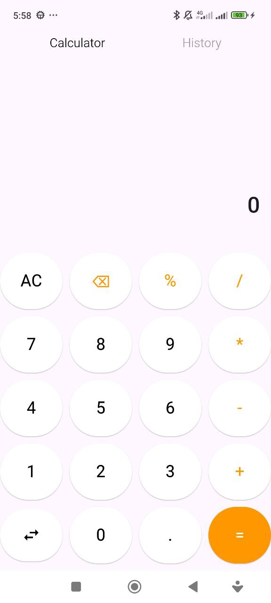
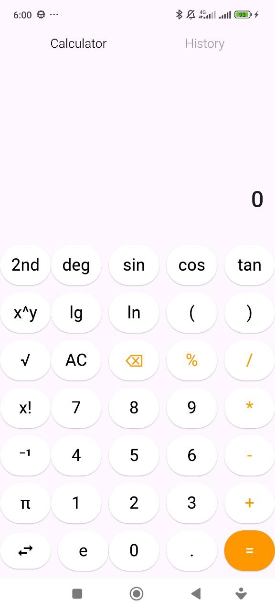

# Calculator App

This project is a simple calculator app built using Flutter. The app allows users to perform basic arithmetic operations such as addition, subtraction, multiplication, and division. It's designed to provide a clean, intuitive user interface for performing calculations.

## Features:
- Supports basic operations: Addition, Subtraction, Multiplication, and Division.
- Simple and user-friendly design.
- Responsive layout for mobile devices.
- Clear and reset buttons for easy use.
- Error handling for invalid input (e.g., division by zero).

## How to Use:
1. Clone or download the project.
2. Run the app on your preferred device/emulator using the command: `flutter run`.
3. Enter numbers and select the desired operation.
4. Press the "Equal" button to get the result.
5. Use the "Clear" button to reset the calculator.

## Screenshots:

## Technologies:
- Flutter
- Dart
